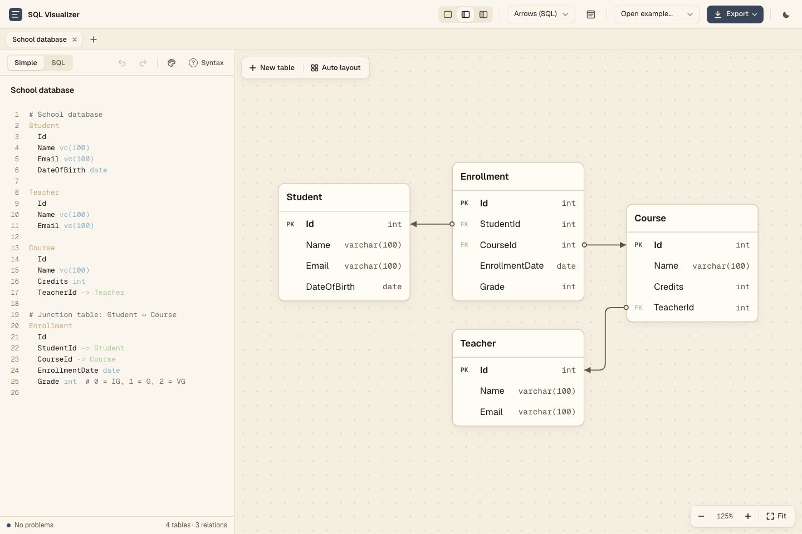
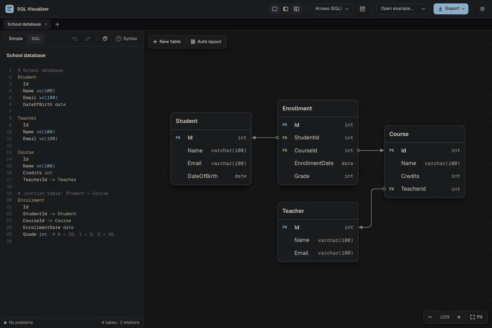

# SQL Visualizer

A browser tool for drawing SQL table diagrams. Arrows connect foreign-key columns directly to the columns they reference, making relationships and JOINs easy to follow.

[Open SQL Visualizer](https://trangius.se/sql_visualizer/)



- Write tables in a simple text format or MariaDB SQL; the diagram updates as you type.
- Drag tables to arrange them, or use auto layout.
- Export diagrams as SVG or PNG, and schemas as MariaDB SQL.
- Keep multiple diagrams in tabs, with light and dark themes.

Diagrams are saved in your browser. Export a copy to keep your work outside it.

## Simple syntax

```text
Owner
  Id
  Name

Dog
  Id
  Name
  OwnerId -> Owner.Id
```

Indent columns under each table. `Id` is an integer primary key; columns without a type default to `varchar(128)`. The **Syntax** button in the app has the full reference.

## Run locally

Open `index.html` in your browser. No installation or build step needed.


